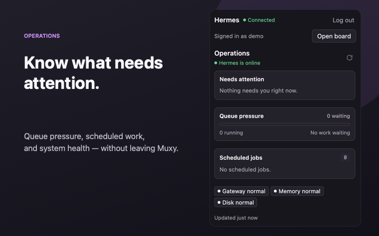
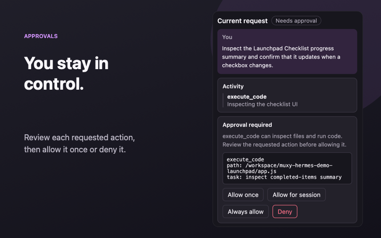
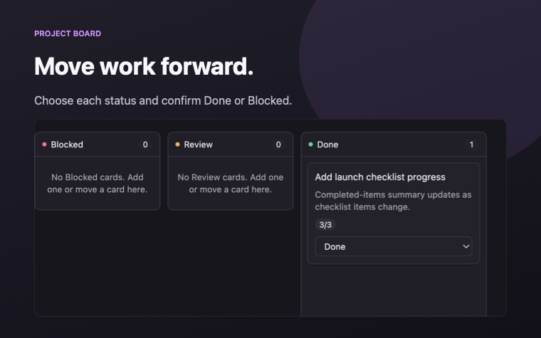

# Hermes Agent for Muxy

[Hermes Agent](https://github.com/NousResearch/hermes-agent) is an open-source AI agent that you run yourself. This extension connects Muxy to the Hermes Dashboard you already have. It does not install Hermes, host it, or change its configuration.

Keep an eye on Hermes, start and guide an agent, respond to approvals, and manage project boards without leaving Muxy.



## Agent runs and approvals

Start a request from the Hermes panel and follow the response and tool activity as it happens. When an action needs approval, the request stays visible until you choose what to do.

- Allow an action once, for the session, or always
- Deny an action, send guidance, or stop the run
- Reconnect automatically if the live connection drops while the panel is open



## Kanban boards

Run **Hermes: Open Project Board** to work with the board currently selected in Hermes.

- Add a card to an available starting status
- Move a card through the status menu as the work changes
- Confirm the change before moving a card to Blocked or Done
- Refresh the board or explicitly select another one

Cards move only when you choose a new status. The extension does not automatically attach an agent request to a card, move cards when a run finishes, or provide drag-and-drop.



## What you need

- Muxy
- An existing Hermes Dashboard that you can reach from your Mac
- A password login provider configured in Hermes

Version `0.1.0` was tested with **Muxy 1.5.0 (945)** and **Hermes 0.20.2**. Other versions may work, but have not been qualified yet. If Hermes returns an incompatible response, the extension stops and shows an error instead of guessing.

OAuth- and OIDC-only Hermes installations are not supported yet.

## Install and connect

1. Install **Hermes Agent** from the Muxy marketplace.
2. Make sure your Hermes Dashboard is running.
3. In Muxy, run **Hermes: Toggle Agent Panel**.
4. Enter the same Dashboard address you would open in a browser, select your password provider, and sign in.
5. To use a project board, run **Hermes: Open Project Board**.

If you previously loaded the development version of this extension, remove it before installing `hermes-agent`. The marketplace version uses a new storage namespace, so you will need to sign in again. Old cookies are not copied.

## Compatibility

| Where Hermes is running | How to connect |
|-------------------------|----------------|
| On your Mac | Use the loopback address shown by Hermes, such as `http://127.0.0.1:8642` |
| In Docker on your Mac | Publish the Dashboard port to `127.0.0.1` and use that address |
| On another machine through SSH | Create your own local `ssh -L` forward, then connect to its `127.0.0.1` address |
| Behind private HTTPS | Use its HTTPS address from a trusted network, VPN, or access layer you control |
| Inside a Muxy SSH workspace | Not supported in version `0.1.0`; follow [the open issue](./OPEN_ISSUES.md) for progress |

The extension does not need to know whether Hermes is native, in Docker, or behind an SSH forward. It only needs a Dashboard address that is reachable from Muxy.

## Current limitations

- Password login only; OAuth and OIDC are not implemented
- One Hermes Dashboard connection at a time
- Live agent controls work only while the panel is open
- No background approvals or background run ownership
- No mapping between Muxy workspace paths and Hermes filesystem paths
- Muxy SSH workspaces are not supported in version `0.1.0`

## Security

Do not expose a password-protected Hermes Dashboard directly to the unrestricted public internet. Use loopback, a trusted local network, a VPN, or an access layer you control. This follows [Hermes's own Dashboard guidance](https://github.com/NousResearch/hermes-agent/blob/main/website/docs/user-guide/features/web-dashboard.md).

The extension never approves an agent action for you. Approval requests stay visible until you choose what to do.

Passwords are used only for the sign-in request and are then cleared. Live connections use short-lived, one-use WebSocket tickets. Saved sessions contain only the Hermes cookies needed to sign you back in.

## Permissions

| Permission | What it is used for |
|------------|---------------------|
| Command execution | Sends requests to the Hermes Dashboard with `/usr/bin/curl`. Request bodies and cookies are passed through stdin, not command arguments. |
| Panel control | Opens and updates the Hermes side panel. |
| Tab control | Opens the Hermes project board. |
| Isolated storage | Saves the Dashboard address, Hermes session cookies, login provider, and selected board for this extension only. |

The extension cannot read or write your workspace files. It does not request Docker, SSH, background-process, or telemetry access.

## Privacy

No analytics or telemetry is collected.

Your password is not saved. WebSocket tickets are not saved. The extension stores the Dashboard address, selected login provider, selected board, and the small set of Hermes session cookies required to restore your sign-in.

Prompts and controls you submit are sent directly to the Hermes Dashboard you configured. The extension does not send them anywhere else.

## Troubleshooting

| What you see | What to do |
|--------------|------------|
| Invalid password | Check the selected provider and password, then try again. |
| OAuth/OIDC not supported | This Hermes installation has no password provider. Use Hermes directly for now. |
| Sign-in expired | Sign in again. The extension removes the expired session. |
| Permission denied | Review Muxy's permission prompt and retry if you intended to allow the action. |
| Muxy SSH workspace unsupported | Open a local Muxy workspace and use your own `ssh -L` forward or a private HTTPS Dashboard address. |
| Agent connection offline | Keep the panel open. The extension will reconnect with a new one-use ticket. |
| Incompatible response | Confirm that Hermes is healthy and check its version. |
| Some operations are unavailable | The corresponding optional Hermes feature or plugin may not be installed. Agent and board features can still work independently. |

## Uninstalling

Disable or uninstall the extension from Muxy. This removes the Muxy integration and its access to saved extension data. It does not stop Hermes, delete Hermes data, or change your Hermes installation.

## Development

Node 20 or newer is required.

```sh
npm ci
npm test
npm run build
npm run validate
npm run qualify
```

`npm run build` creates the marketplace package in `dist/`. `npm run validate` checks the package, permissions, assets, secret safety, and reproducible build output. `npm run qualify` runs the disposable connection lab for the supported connection methods.

`npm run qualify:native` only reproduces the known Muxy SSH-workspace problem. It is not part of the normal release check.
